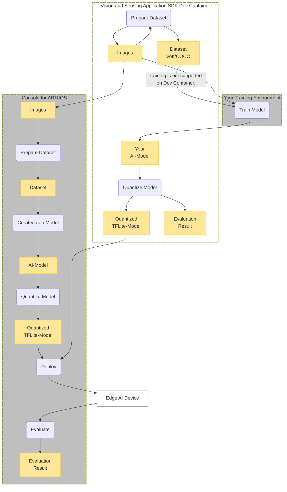
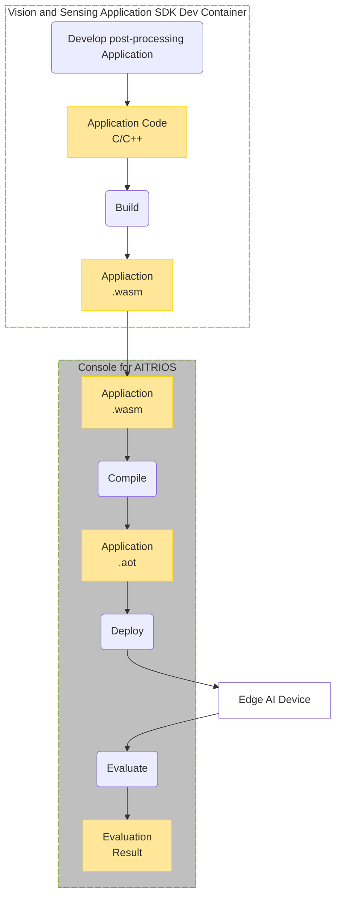

# Vision and Sensing Application SDK for AITRIOS&trade;

## Contents <!-- omit in toc -->
- [Overview](#overview)
  - [What you can do with the Vision and Sensing Application SDK](#what-you-can-do-with-the-vision-and-sensing-application-sdk)
  - [Components](#components)
  - [Restrictions](#restrictions)
- [Installation Guide](#installation-guide)
- [Tutorials](#tutorials)
- [Documentation](#documentation)
  - [SDK Functional Specifications](#sdk-functional-specifications)
- [Get a support](#get-a-support)
- [See also](#see-also)
- [Trademark](#trademark)


## Overview
Vision and Sensing Application SDK for AITRIOS is a toolkit for developing AI models and  post-processing applications that can be installed on Edge AI Devices.
The models and post-processing applications can be deployed to Edge AI Devices through Console for AITRIOS.


### What you can do with the Vision and Sensing Application SDK
- Use GitHub Codespaces (Dev Container) as development environment.
  - You don't need to install any additional tools in your environment.
<br>

- Use tools for developing your AI models in the container.
<br>

- Develop post-processing applications using build environment and sample code included in the container.
<br>

- Access documentation link for deploying models and post-processing applications to devices through Console for AITRIOS.

### Components
Vision and Sensing Application SDK is provided as Development Container (Dev Container) that runs on GitHub Codespaces or Docker environment on Local PC.
This container includes tools and jupyter notebooks that can be used for development.


  ```mermaid
  graph TB;
    %% definition
    classDef object fill:#FFE699, stroke:#FFD700
    classDef device fill:#FFFFFF
    classDef sdk fill:#FFFFFF, stroke:#6b8e23, stroke-dasharray: 10 2
    classDef external_service fill:#BFBFBF, stroke:#6b8e23, stroke-dasharray: 10 2
    style legend fill:#FFFFFF, stroke:#000000

    %% impl
    subgraph legend["legend"]
    process(Process)
    object[Data/Artifact]:::object
    sdk[SDK]:::sdk
    extern[External Service]:::external_service
    device[Device]:::device
    end

  ```

#### Workflow for developing AI models


#### Workflow for developing post-processing applications



- **Console for AITRIOS** <br>
Following functions are available on Console for AITRIOS:
    - manage device
    - upload image from device
    - import image
    - import AI model
    - import post-processing application
    - deploy model and post-processing application to device
    - create model
    - annotate image (for AI model created on Console for AITRIOS)
    - train model (for AI model created on Console for AITRIOS)

<br>

- **Dev Container** <br>
Dev Container provides tools and notebooks to support cases where you want to create your own AI model and run it on Edge AI Devices.<br>
Following functions are available on Dev Container.
  - Prepare dataset:
    - Jupyter notebook for downloading images
    - Image Annotation tool (VoTT)
    - Jupyter notebook for converting dataset format from VoTT to COCO
  - Quantize Models:
    - Jupyter notebook for quantizing models

  - See [Tutorials](./tutorials/README.md) for details on each notebook and tool.

### Restrictions

#### About Vision and Sensing Application SDK

- AI model training
    - AI model training functions on the Dev Container is not provided.
    - Datasets created on the Dev Container cannot be used for training base AI models (only for training user's custom AI models).
<br>

- AI model quantization on Dev Container
    - Supported AI models are based on [Model Compression Toolkit (MCT)'s features](https://github.com/sony/model_optimization/tree/v1.3.0#supported-features).
<br>

- Jupyter specification
    - Variables in jupyter notebook are cleared when GitHub Codespaces stop.

#### About AITRIOS

- Evaluation of output results
    - Images and inference results output from devices cannot be downloaded from Console for AITRIOS.
    - Inference results displayed on Console for AITRIOS are serialized. 
    - Images and inference results can be downloaded using API, but since the inference results are serialized, the deserializer is required. 
        - See [Cloud SDK Deserialize Sample Tutorial](https://developer.aitrios.sony-semicon.com/development-guides/tutorials/cloud-sdk/) for details.
    
<br>

- Device operation
    - Edge AI Devices can only be operated through Console for AITRIOS.
<br>

#### About GitHub Codespaces

- Codespaces specification
    - It takes about 15 minutes to start a container on Codespaces for the first time. From the second time onwards, it starts up within 1 minute.
    - By default, a container on Codespaces continues running for 30 minutes without any operation. You can change the settings for up to 4 hours.

## Installation Guide

See [Development Environment Setup Guide](https://developer.aitrios.sony-semicon.com/development-guides/get-started/setup-dev/).
<br>

>**NOTE**
>
> - 4-core (8GB) or higher machine types are recommended when using image annotation tool (VoTT) or quantization tool in Codespaces.
> - To ensure security of connection for VoTT, do NOT make [Codespace's port forwarding sharing option](https://docs.github.com/en/codespaces/developing-in-codespaces/forwarding-ports-in-your-codespace) "Public".

## Tutorials
You can start the development workflow using the tutorial. <br>
See [Vision and Sensing Application SDK tutorials](./tutorials/README.md).


## Documentation
### SDK Functional Specifications
- Prepare dataset
    - [Image Download Functional Specifications](./docs/development-docs/PDF/VisionandSensingApplicationSDK_FuncSpec_ImageDownload_ja.pdf)
    - [Image Annotation Functional Specifications](./docs/development-docs/PDF/VisionandSensingApplicationSDK_FuncSpec_ImageAnnotation_ja.pdf)

- Quantize model
    - [Model Quantization Functional Specifications](./docs/development-docs/PDF/VisionandSensingApplicationSDK_FuncSpec_ModelQuantization_ja.pdf)

- Post process
    - [Post Vision App Functional Specifications](./docs/development-docs/PDF/VisionandSensingApplicationSDK_FuncSpec_PostVisionApp_ja.pdf)

- Development container
    - [Development Container Functional Specifications](./docs/development-docs/PDF/VisionandSensingApplicationSDK_FuncSpec_DevelopmentContainer_ja.pdf)

- Version control
    - [Version Control Functional Specifications](./docs/development-docs/PDF/VisionandSensingApplicationSDK_FuncSpec_VersionControl_ja.pdf)

## Get a support
- [Contact us](https://developer.aitrios.sony-semicon.com/contact-us/)

## See also
- [Console for AITRIOS](https://console.aitrios.sony-semicon.com/)
- [Console Manual](https://developer.aitrios.sony-semicon.com/development-guides/documents/manuals/)
- [Cloud SDK Visualization Tutorial](https://developer.aitrios.sony-semicon.com/development-guides/tutorials/cloud-sdk/)

## Trademark
- [Read This First](https://developer.aitrios.sony-semicon.com/development-guides/documents/manuals/)

