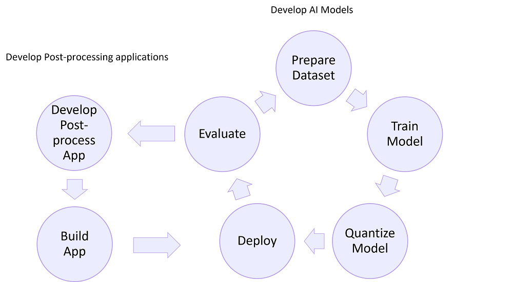
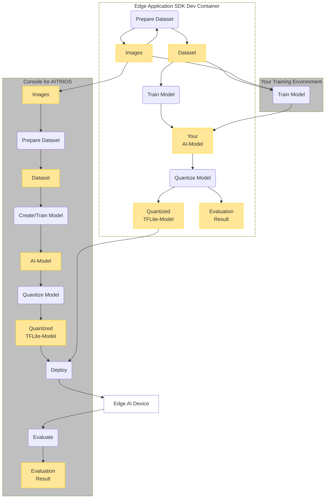
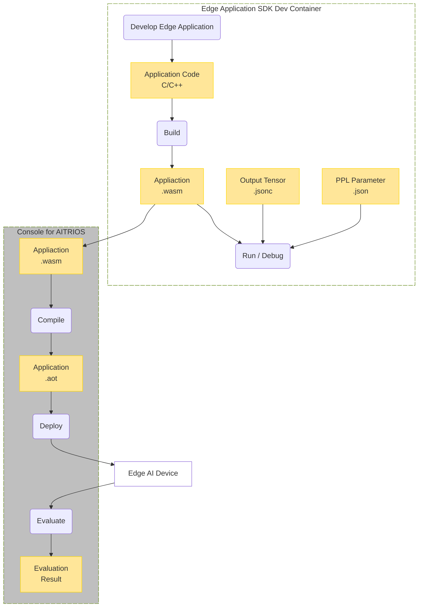

# "**Edge Application SDK**" for AITRIOS&trade;

## Contents <!-- omit in toc -->
- ["**Edge Application SDK**" for AITRIOS™](#edge-application-sdk-for-aitrios)
  - [Overview](#overview)
    - [What you can do with the "**Edge Application SDK**"](#what-you-can-do-with-the-edge-application-sdk)
    - [Components](#components)
      - [Workflow for developing AI models](#workflow-for-developing-ai-models)
      - [Workflow for developing Edge Applications](#workflow-for-developing-edge-applications)
    - [Restrictions](#restrictions)
      - [About "**Edge Application SDK**"](#about-edge-application-sdk)
      - [About AITRIOS](#about-aitrios)
      - [About GitHub Codespaces](#about-github-codespaces)
  - [Installation Guide](#installation-guide)
  - [Samples](#samples)
  - [Tutorials](#tutorials)
  - [Migration Guide](#migration-guide)
  - [Documentation](#documentation)
    - [SDK Functional Specifications](#sdk-functional-specifications)
  - [Get support](#get-support)
  - [See also](#see-also)
  - [Trademark](#trademark)
  - [Security](#security)
  - [AI Ethics](#ai-ethics)
  - [Versioning](#versioning)
  - [Branch](#branch)

## Overview
"**Edge Application SDK**" for AITRIOS is a toolkit for developing AI models and post-processing applications that can be installed on Edge AI Devices. Post-processing applications are called "**Edge Applications**".
The models and "**Edge Applications**" can be deployed to Edge AI Devices through "**Console for AITRIOS**".



### What you can do with the "**Edge Application SDK**"
- Use GitHub Codespaces (Dev Container) as development environment.
  - You don't need to install any additional tools in your environment.
<br>

- Develop your AI models in the container.
<br>

- Develop "**Edge Applications**" using build environment and sample code included in the container.
<br>

- Import AI models and "**Edge Applications**" to "**Console for AITRIOS**" and deploy them to Edge AI Devices.

### Components
"**Edge Application SDK**" is provided as Development Container (Dev Container) that runs on GitHub Codespaces or Docker environment on Local PC.
This container includes tools and jupyter notebooks that can be used for development.

<!-- mermaid alt text: Legend -->
  ```mermaid
  graph TB;
    %% definition
    classDef object fill:#FFE699, stroke:#FFD700
    classDef device fill:#FFFFFF
    classDef sdk fill:#FFFFFF, stroke:#6b8e23, stroke-dasharray: 10 2
    classDef external_service fill:#BFBFBF, stroke:#6b8e23, stroke-dasharray: 10 2
    style legend fill:#FFFFFF, stroke:#000000

    %% impl
    subgraph legend["legend"]
    process(Process)
    object[Data/Artifact]:::object
    sdk[SDK]:::sdk
    extern[External Service]:::external_service
    device[Device]:::device
    end

  ```

#### Workflow for developing AI models
<!-- mermaid alt text: Workflow for developing AI models -->


#### Workflow for developing "**Edge Applications**"
<!-- mermaid alt text: Workflow for developing Edge Applications -->



- **Console for AITRIOS** <br>
Following functions are available on "**Console for AITRIOS**":
    - manage device
    - upload image from device
    - import image from your local PC or storages
    - import AI model
    - import "**Edge Application**"
    - deploy model and "**Edge Application**" to device
    - create model
    - annotate image (for AI model created on "**Console for AITRIOS**")
    - train model (for AI model created on "**Console for AITRIOS**")

<br>

- **Dev Container** <br>
Dev Container provides tools and notebooks to support cases where you want to create your own AI model and run it on Edge AI Devices.<br>
Following functions are available on Dev Container.
  - Prepare dataset:
    - Jupyter notebook for downloading images
    - Tools for image annotation
  - Prepare models:
    - Jupyter notebook for training models
    - Jupyter notebook for quantizing models
    - Jupyter notebook for importing models to "**Console for AITRIOS**"
    - Jupyter notebook for deploying models to Edge AI Devices
  - Prepare applications:
    - Tools for developing, building and debugging "**Edge Applications**"
    - Jupyter notebook for importing "**Edge Applications**" to "**Console for AITRIOS**"
    - Jupyter notebook for deploying "**Edge Applications**" to Edge AI Devices
  - See [Tutorials](./tutorials/README.md) for details on each notebook and tool.

### Restrictions

#### About "**Edge Application SDK**"

- AI model training
    - Datasets for Object Detection created on the Dev Container cannot be used for training base AI models (only for training user's custom AI models).
<br>

- AI model quantization on Dev Container
    - Supported AI models are based on ["**Model Compression Toolkit (MCT)**"'s features](https://github.com/sony/model_optimization/tree/v1.8.0#supported-features).
<br>

- Jupyter specification
    - Variables in jupyter notebook are cleared when GitHub Codespaces stop.

#### About AITRIOS

- Evaluation of output results
    - Images and inference results output from devices cannot be downloaded from "**Console for AITRIOS**".
    - Inference results displayed on "**Console for AITRIOS**" are serialized. 
    - To deserialize inference results, see [README for deserializing](./tutorials/_common/deserialize/README.md).
    
<br>

- Device operation
    - Edge AI Devices can only be operated through "**Console for AITRIOS**".
<br>

#### About GitHub Codespaces

- Codespaces specification
    - It takes about 15 minutes to start a container on Codespaces for the first time. From the second time onwards, it starts up within 1 minute.
    - By default, a container on Codespaces continues running for 30 minutes without any operation. You can change the settings for up to 4 hours.

## Installation Guide

See [Development Environment Setup Guide](https://developer.aitrios.sony-semicon.com/en/downloads#sdk-getting-started).
<br>

>**NOTE**
>
> - 4-core (8GB) or higher machine types are recommended when using the SDK on Codespaces.
>     - If 2-core is selected, an error may occur during Dev Container build.
> - To ensure security of connection for CVAT, do NOT make [Codespace's port forwarding sharing option](https://docs.github.com/en/codespaces/developing-in-codespaces/forwarding-ports-in-your-codespace) "Public".
> - If Jupyter Kernels picker displayed when you try to run Jupyter notebook first time, please select "Python Environment" and select "Python 3.8".

## Samples
You can learn the development workflow using the samples in a day. <br>
See ["**Edge Application SDK**" samples](./samples/README.md).

## Tutorials
You can start the development workflow using the tutorial. <br>
See ["**Edge Application SDK**" tutorials](./tutorials/README.md).

>**NOTE**
>
> If you are unfamiliar with "**Edge Application SDK**", it's recommended to learn with [Samples](#samples) first.

## Migration Guide

### From SDK v0.2 to v1.0

If you have already developed the "**Edge Application**" using SDK v0.2,
you need to modify the "**Edge Application**" source code to migrate to SDK v1.0.

See ["**Edge Application**" Migration Guide from SDK v0.2 to v1.0](./tutorials/4_prepare_application/1_develop/README_migration_0.2_1.0.md).

## Documentation
### SDK Functional Specifications
- Prepare dataset
    - ["**Image Download Functional Specifications**"](./docs/development-docs/AsciiDoc/EdgeApplicationSDK_FuncSpec_ImageDownload.adoc)
    - ["**Image Annotation CVAT Functional Specifications**"](./docs/development-docs/AsciiDoc/EdgeApplicationSDK_FuncSpec_ImageAnnotationCvat.adoc)

- Prepare model
    - ["**Model Training Functional Specifications**"](./docs/development-docs/AsciiDoc/EdgeApplicationSDK_FuncSpec_ModelTraining.adoc)
    - ["**Model Quantization Functional Specifications**"](./docs/development-docs/AsciiDoc/EdgeApplicationSDK_FuncSpec_ModelQuantization.adoc)

- Prepare application
    - ["**Application Development Functional Specifications**"](./docs/development-docs/AsciiDoc/EdgeApplicationSDK_FuncSpec_ApplicationDevelopment.adoc)

- Setup "**Console Access Library**"
    - ["**Console API Initialize Functional Specifications**"](./docs/development-docs/AsciiDoc/EdgeApplicationSDK_FuncSpec_APIInitialize.adoc) 

- Import AI model and "**Edge Applications**" to "**Console for AITRIOS**"
    - ["**AI model and application Import Functional Specifications**"](./docs/development-docs/AsciiDoc/EdgeApplicationSDK_FuncSpec_ModelAndPPLImport.adoc)

- Deploy AI model and "**Edge Applications**" to Edge AI Device
    - ["**AI model and application Deploy Functional Specifications**"](./docs/development-docs/AsciiDoc/EdgeApplicationSDK_FuncSpec_ModelAndPPLDeploy.adoc)

- Development container
    - ["**Development Container Functional Specifications**"](./docs/development-docs/AsciiDoc/EdgeApplicationSDK_FuncSpec_DevelopmentContainer.adoc)

- Version control
    - ["**Version Control Functional Specifications**"](./docs/development-docs/AsciiDoc/EdgeApplicationSDK_FuncSpec_VersionControl.adoc)

- Deserialize
    - ["**Deserialize Functional Specifications**"](./docs/development-docs/AsciiDoc/EdgeApplicationSDK_FuncSpec_Deserialize.adoc)

## Get support
- [Contact us](https://developer.aitrios.sony-semicon.com/contact-us/)

## See also
- ["**Console for AITRIOS**"](https://console.aitrios.sony-semicon.com/)
- ["**Console Manual**"](https://developer.aitrios.sony-semicon.com/en/documents/console-user-manual)
- ["**Cloud SDK Visualization Tutorial**"](https://github.com/SonySemiconductorSolutions/aitrios-sdk-visualization-ts/tree/main/docs/development-docs/)
- ["**Developer Site**"](https://developer.aitrios.sony-semicon.com/en/edge-ai-sensing/)

## Trademark
- [Read This First](https://developer.aitrios.sony-semicon.com/en/documents/read-this-first)

## Security
Before using Codespaces, please read the Site Policy of GitHub and understand the usage conditions. 

## AI Ethics
This SDK is optimized for use with Sony's AITRIOS™ (https://developer.aitrios.sony-semicon.com/edge-ai-sensing/). If you are willing to take part in the AITRIOS and use services provided through AITRIOS, you must sign up with https://developer.aitrios.sony-semicon.com/edge-ai-sensing/ and comply with AITRIOS Terms of Use and other applicable terms of use in addition to the license terms of this SDK.

AITRIOS is a one-stop platform that provides tools and environments to facilitate software and application development and system construction.

Sony, with the aim of utilizing AI technology to enrich people's life styles and contribute to the development of society, Sony will pursue accountability and transparency while actively engaging in dialogue with stakeholders. Sony will continue to promote responsible AI in order to maintain the trust of products and services by stakeholders. 

Users of this SDK should refer to and understand our thoughts and initiatives about AI. You can learn more here, including Sony Group AI Ethics Guidelines. https://www.sony.com/en/SonyInfo/sony_ai/responsible_ai.html

## Versioning

This repository aims to adhere to Semantic Versioning 2.0.0.

## Branch

See the "**Release Note**" from [**Releases**] for this repository.

Each release is generated in the main branch. Pre-releases are generated in the develop branch. Releases will not be provided by other branches.
