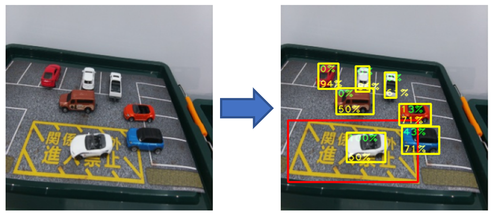

# Zone Detection

## Learn the SDK workflow in a day

### Terms

- "**Zone Detection**"

    ["**Zone Detection**"](https://developer.aitrios.sony-semicon.com/development-guides/tutorials/sample-application/) is a sample application of AITRIOS.

- "**Edge Application**"

    "**Edge Application**" is post-processing application of AI model's Output Tensor running on Edge AI Device.

    Please see [../../tutorials/4_prepare_application/1_develop/README.md](../../tutorials/4_prepare_application/1_develop/README.md) for details.

### Overview

A sample jupyter notebook demonstrates a workflow of "**Edge Application SDK**" for "**Zone Detection**".

In "**Edge Application**" for "**Zone Detection**", by calculating IoU (Intersection over Union) in Edge AI Device, there is an advantage that the amount of uploading data to the cloud can be reduced.

#### Example of an original image as input and an image with inference results as output

### Workflow

1. Prepare dataset 
Prepare the dataset pre-installed in the SDK.
2. Prepare AI model 
Create the Custom Vision model using "**Console UI**".
3. Prepare "**Edge Application**" 
Optimize the "**Edge Application**" provided by the SDK by changing parameters for the "**Edge Application**".
4. Run "**Edge Application**" with mock 
Run the "**Edge Application**" on the SDK before deploying it to Edge AI Devices.
5. Deploy AI model and "**Edge Application**" 
Import the "**Edge Application**" to "**Console for AITRIOS**" and deploy the AI model and the "**Edge Application**" to Edge AI Devices.
6. Evaluate 
Run inference using "**Console for AITRIOS**". 
This chapter requires a subject of images.
We recommend car and parking objects like the ones in the image of the dataset preinstalled in the SDK.
There is no problem using a picture instead of actual objects.

### Instruction

Please open [sdk_in_a_day.ipynb](./sdk_in_a_day.ipynb) and run step-by-step (one cell a time).
