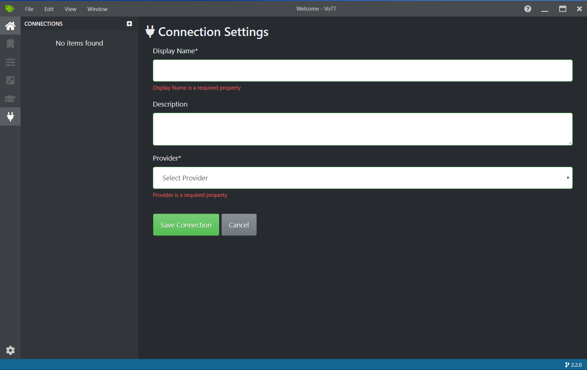
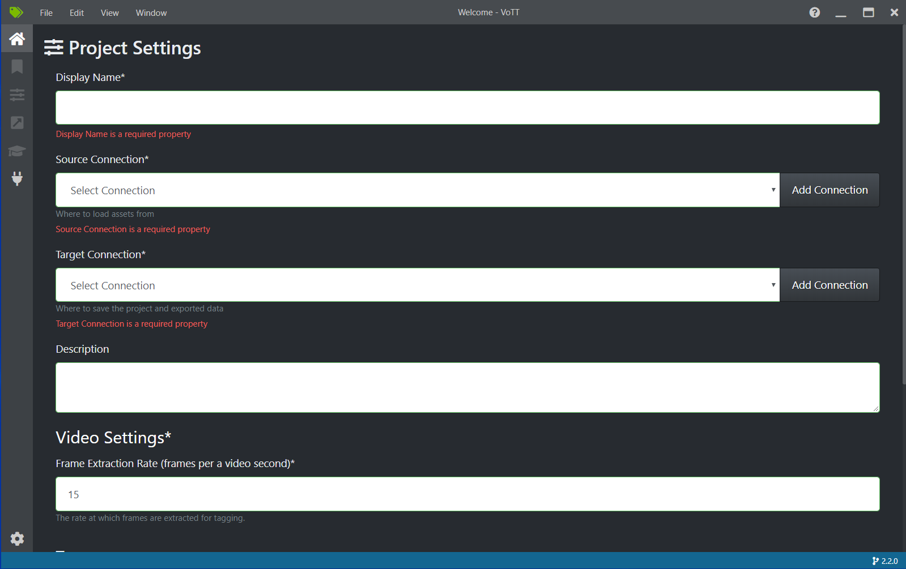
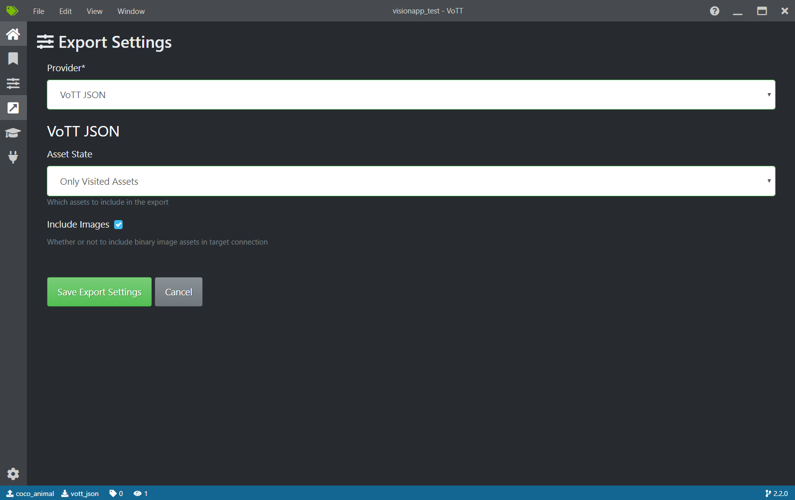
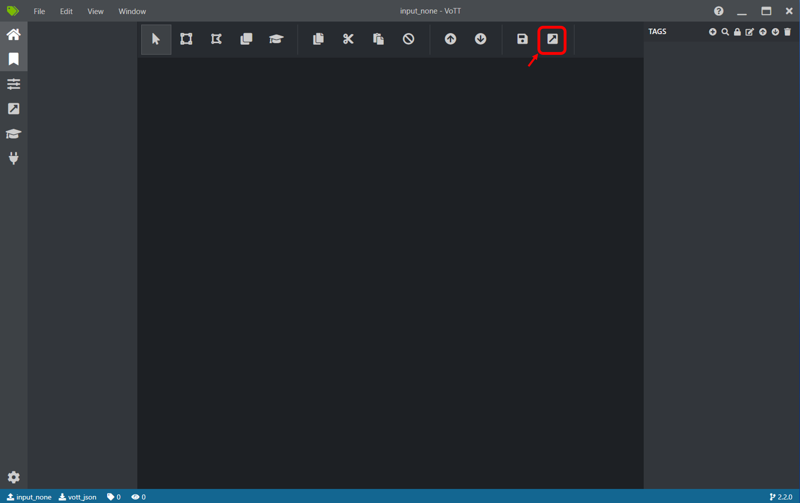

# Tag Images with VoTT
Images without annotations can be tagged using VoTT built into the vision and sensing application SDK.

## 1. Set up VoTT

1. In the Vision and Sensing Application SDK devcotainer's VS Code PORTS tab, open "Desktop access" Port 6080.
Then noVNC connect screen appears in the Web browser.
<br>

2. Click "connect" button, input "vscode" as password and click "Send credentials" button. 
Then desktop GUI appears.
<br>

3. Right-click the black desktop to display menu, select "Terminal" in the menu. 
Then terminal window appears.
<br>

4. Run following command in the terminal.

```terminal
$ ~/vott.sh
```

Then VoTT desktop app window appears.

### Connection settings
#### Source Connection settings
Here, set the import source of image data.
1. Click the plug icon (Connections) in the left navigation bar and click the "+" button to open "Connection Settings".
2. Enter "Display Name".
3. Set "Provider". You can import images from dev container.
  - Import images from dev container file system<br>
  Select "Local File System" in the Provider drop-down list, and then click "Select Folder" and choose the folder where you saved the images.<br>
  You can find folders on the Dev Container by in the following location:<br>
  [Other Locations] - [Computer] - [workspaces]
4. Click "Save Connection".

>**NOTE**
>
> If you want to paste text copied on the host side, such as SAS tokens, into the container's VoTT settings, follow these steps:
> 
> 1. Click the second icon (Clipboard) from the top of the noVNC navigation bar on the left side of the screen
> 2. Paste the text copied on the host side to the clipboard.
> 3. Right-click text box for the the VoTT settings and select "Paste".
 
#### Target Connection settings
Next, set the target location to save the annotation file created with VoTT.
1. Click the plug icon (Connections) in the left navigation bar.
2. Enter "Display Name".
3. Set "Provider".
  Select "Local File System" in the Provider drop-down list, and then click "Select Folder" and choose the folder where you want to store the annotation files.<br>
  You can find folders on the Dev Container by in the following location:<br>
  [Other Locations] - [Computer] - [workspaces]<br>
4. Click "Save Connection".



### Project settings
1. Click the home icon (Home) in the left navigation bar and select "New Project".
2. Enter "Display Name".
3. In the Source Connection drop-down list, select the connection settings created in [Source Connection settings](#source-connection-settings).
4. In the Target Connection drop-down list, select the connection settings created in [Target Connection settings](#target-connection-settings).
5. Click "Save Project".



## 2. Tag Images

Click the bookmark icon (Tags Editor) in the left navigation bar and tag the images using VoTT.<br>
See [Labeling an Image](https://github.com/microsoft/VoTT#labeling-an-image) for details.

## 3. Export Label
### Configure export settings
1. Click the arrow icon (Export) in the left navigation bar.
2. Select the "VoTT Json" in the Provider drop-down list and check "Include Images", and then click "Save Export Settings".


### Export
1. Click the bookmark icon (Tags Editor) in the left navigation bar.
2. Click the "Export" button.
