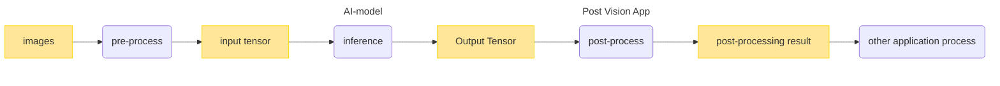
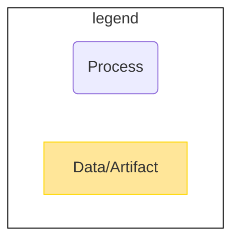

# Develop Application

This tutorial shows how to create a Post Vision App for the IMX500. The Post Vision App has an AI-Post process that processes AI output into usable data for application development. This section shows how to design, implement, and build the Post Vision App.



<br>
  


## Getting Started
This tutorial includes the [sample Post Vision App](./sample/).
There are two types of sample:
- [Image classification sample](./sample/classification/)
  - Post-processing of the AI model output to limit the output by setting the maximum number of predictions
- [Object detection sample](./sample/objectdetection/)
  - Post-processing of the AI model output to limit the output by setting the maximum number of detections and the threshold

Start with the sample to learn how to create a Post Vision App.

It also provides a sample Post Vision App for parameter debugging.
See [README for parameter debugging](./sample/param_debug/README.md) for more information.

### Design and implement the Post Vision App
#### 1. Write a FlatBuffers schema
The output of the Post Vision App is serialized by [FlatBuffers](https://google.github.io/flatbuffers/index.html).
Define the Post Vision App output in the FlatBuffers schema file.

See the following information on writing a FlatBuffers schema.
- [Writing a schema](https://google.github.io/flatbuffers/flatbuffers_guide_writing_schema.html) in FlatBuffers documents
- Sample FlatBuffers schema files 
  - [Image classification](./sample/schema/classification.fbs)
  - [Object detection](./sample/schema/objectdetection.fbs)

#### 2. Generate a C++ header file from the FlatBuffers schema file
Open the Terminal and run the following command:
```bash
$ ./tutorials/4_prepare_application/1_develop/compile_fbs.sh
```
Then, C++ header files are generated in **`./tutorials/4_prepare_application/1_develop/sample/schema/`**.

> **NOTE**
> 
> The script that generates the C++ header is for the sample.
> Modify the **`docker run`** command in [compile_fbs.sh](./compile_fbs.sh) to match the location of the FlatBuffers schema file you created. For the following **`<your-schema-folder-path>`**, set the path relative to the folder containing your FlatBuffers schema file from the **`/tutorials/4_prepare_application/1_develop`** folder.
> ```sh
> docker run --rm \
>     -v $PWD/<your-schema-folder-path>:/root/schema/ \
>     $NAME_IMAGE:latest \
>     /bin/sh -c "cd /root/schema && flatc --cpp *.fbs"
> ```

> **NOTE**
> 
> See [Using the schema compiler](https://google.github.io/flatbuffers/flatbuffers_guide_using_schema_compiler.html) for options for the **`flatc`** command in [compile_fbs.sh](./compile_fbs.sh).

#### 3. Implement a Post Vision App
Implement a Post Vision App in C or C++ languages.

Use the C++ header file generated in [Generate a C++ header file from the FlatBuffers schema file](#2-generate-a-c-header-file-from-the-flatbuffers-schema-file). The implementations using FlatBuffers need to be written in C++.

Post Vision Apps require the implementation of the Post Vision App interface. See [PPL Library API Specification for IMX500](https://developer.aitrios.sony-semicon.com/development-guides/documents/specifications/) for information. See also the [interface definition file](./ppl_sdk/imx_app/include/ppl_public.h).

See the [/tutorials/4_prepare_application/1_develop/sample](./sample/) for the sample implementation.

> **NOTE**
> 
> There are the following restrictions when implementing a Post Vision App.
> - The Post Vision App is compiled to Wasm file. Features that are in [libc-wasi](https://github.com/WebAssembly/wasi-libc) can be used without any extra steps, but features that are not in libc-wasi require the libraries to be statically linked.
> - Functions that require access to the Native side from WASM such as using OS functions cannot be used. GPIO and network systems, for example.
> - Multithreading is not allowed.
> - Large libraries cannot be included (because there is a limit on the file size that can be deployed to the device)

### Build the Post Vision App
#### 1. (Optional) Edit the Makefile ([Image classification](./sample/classification/Makefile) / [Object detection](./sample/objectdetection/Makefile))
If you use the sample Post Vision App, you do not need to edit the Makefile.

- If you want to statically link dependencies, add **`-I <directory>`** to the build options: **`USER_CFLAGS`**
```makefile
USER_CFLAGS    = -O2
```

- Set the names of the object files in **`CPPOBJS`**
```makefile
CPPOBJS        = ppl_classification.o \
                 $(LIBPATH)/lib/parson/parson.o
```

- Specify the .c or .cpp files to build
```makefile
%.o: %.c
```
```makefile
%.o: %.cpp
```

> **NOTE**
> 
> You can customize following build options **`USER_CFLAGS`**, **`USER_LDFLAGS`** if necessary, but do not edit the other options.
> Don't change **`USER_CFLAGS=-g -O0`** in debug builds. The debugging function does not work properly.
> ```makefile
> USER_CFLAGS    = -O2
> USER_LDFLAGS   = -z stack-size=8192 \
>                  -Wl,--initial-memory=65536
> ```
> Some of changeable options are followings. If you want to tune memory of your Wasm app, please visit [Memory model and memory usage tunning](https://github.com/bytecodealliance/wasm-micro-runtime/blob/main/doc/memory_tune.md). Please understand that there are limitation to the amount of memory that can be used in total.
> | option | description | default | limitation |
> ----|----|----|----
> | -z stack-size=***NUM*** | specify stack size of thread **(aux stack area)** | 8192 [byte]  | 16 [byte] alignment |
> | -Wl, --initial-memory=***NUM*** | specify initial usage of memory size **(libc heap)** | 65536 [byte] | 65536 [byte] alignment |
> | -I ***PATH*** | add include PATH | - | add only |
> | -O2 | optimize | - | changeable if the text section size is within 256 KB<br> See [Restrictions](#restrictions) for details.
 |

#### 2. Build
Open the Terminal and run the following command:
```bash
$ ./tutorials/4_prepare_application/1_develop/build.sh
```
Then, the following files are generated:
- **`/tutorials/4_prepare_application/1_develop/sample/classification/release/ppl_classification.wasm`**
- **`/tutorials/4_prepare_application/1_develop/sample/objectdetection/release/ppl_objectdetection.wasm`**

If you want to build the [sample code for parameter debugging](./sample/param_debug/), run the following command in the terminal:
```bash
$ ./tutorials/4_prepare_application/1_develop/build.sh -t param_debug
```
Then, the following file is generated:
- **`/tutorials/4_prepare_application/1_develop/sample/param_debug/ppl_objectdetection.wasm`**

> **TIP**
> 
> Execute the command with the **`ic`** option if you want to build only the image classification sample, and the **`od`** option if you want to build only the object detection sample.
> ```bash
> $ ./tutorials/4_prepare_application/1_develop/build.sh -t <Option>
> ```
 
> **NOTE**
> 
> The build script is for building the sample. Modify the **`docker run`** command in [build.sh](./build.sh) to match the location of the Post Vision App you created. 
> For the following`<your-Makefile-folder-path>`, set the path relative to the folder containing your Makefile from the **`/tutorials/4_prepare_application/1_develop`** folder.
> ```sh
> docker run --rm \
>     -v $PWD/<your-Makefile-folder-path>/:$PWD/<your-Makefile-folder-path>/ \
>     -v $PWD/ppl_sdk/:$PWD/ppl_sdk/ \
>     $NAME_IMAGE:latest \
>     /bin/sh -c "cd ${PWD}/<your-Makefile-folder-path> && make"
> ```
> As for the following [clean](#clean), the **`docker run`** command needs to be modified in the same way.

#### 3. Clean
Open the terminal and run one of the following commands depending on what you want to remove:
- Remove the generated object files and Wasm files
```bash
$ ./tutorials/4_prepare_application/1_develop/build.sh -c
```

- Remove the generated object files, Wasm files and Docker image for Wasm build
```bash
$ ./tutorials/4_prepare_application/1_develop/build.sh -C
```

### 4. (Optional) Running/debugging Wasm in Vision and Sensing Application SDK

If you want to run and debug Wasm in Vision and Sensing Application SDK,

see [README_wasmdebug.md](./README_wasmdebug.md) for details.

## Restrictions
- Files of the Post Vision App that can be deployed to a device must have an text section size of 256 KB or less.
- For a Post Vision App, the maximum RAM size is 2 MB (Global variable + Stack size + OutputTensor + UserHeap total).
- Users are responsible for the combination of AI model and Post Vision App, and the system does not check beforehand.

## References
- [FlatBuffers](https://google.github.io/flatbuffers/index.html)<br>
The version of FlatBuffers used in Vision and Sensing Application SDK is 1.11.0.

- [WASI SDK](https://github.com/WebAssembly/wasi-sdk)<br>
The version of WASI SDK used in Vision and Sensing Application SDK is wasi-sdk-16.
