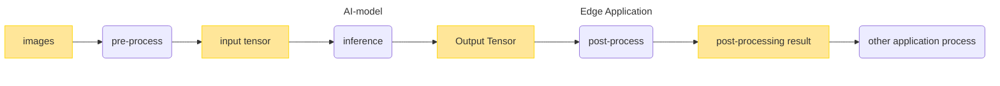
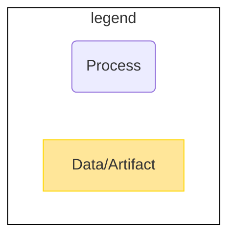
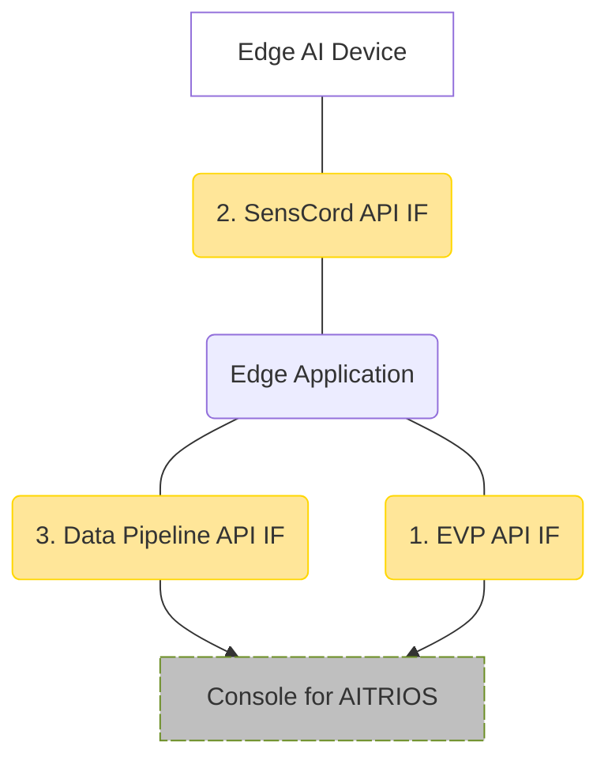
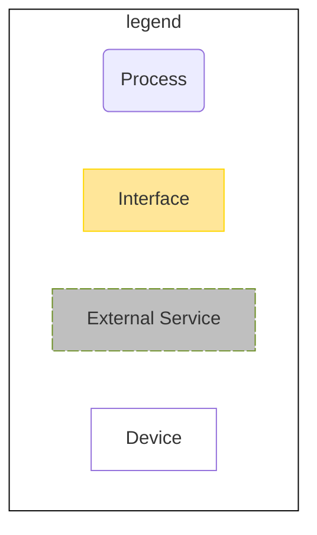

# Develop Application

This tutorial shows how to create a "**Edge Application**" for the IMX500. The "**Edge Application**" has an AI-Post process that processes AI output into usable data for application development. This section shows how to design, implement, and build the "**Edge Application**".

<!-- mermaid alt text: Edge Application -->


<br>

<!-- mermaid alt text: Legend -->


## Getting Started
This tutorial includes the [sample "**Edge Application**"](./sdk/sample/).
There are three types of sample:
- [Image classification sample](./sdk/sample/vision_app/single_dnn/classification/)
- [Object detection sample](./sdk/sample/vision_app/single_dnn/objectdetection/)
- [Switching DNN sample](./sdk/sample/vision_app/switch_dnn/switch_od_ic/)

Start with the sample to learn how to create a "**Edge Application**".

### Design and implement the "**Edge Application**"
#### 1. Write a FlatBuffers schema
The output of the "**Edge Application**" is serialized by [FlatBuffers](https://google.github.io/flatbuffers/index.html).
Define the "**Edge Application**" output in the FlatBuffers schema file.

See the following information on writing a FlatBuffers schema.
- [Writing a schema](https://google.github.io/flatbuffers/flatbuffers_guide_writing_schema.html) in FlatBuffers documents
- Sample FlatBuffers schema files 
  - [Image classification](./sdk/schema/classification.fbs)
  - [Object detection](./sdk/schema/objectdetection.fbs)
  - [Switch DNN object detection](./sdk/schema/switch_dnn_objectdetection.fbs)
  - [Switch DNN image classification](./sdk/schema/switch_dnn_classification.fbs)

#### 2. Generate a C++ header file from the FlatBuffers schema file
Open the Terminal and run the following command:
```bash
$ ./tutorials/4_prepare_application/1_develop/compile_fbs.sh
```
Then, C++ header files are generated in **`./tutorials/4_prepare_application/1_develop/sdk/schema/`**.

> **NOTE**
> 
> The script that generates the C++ header is for the sample.
> Modify the **`docker run`** command in [compile_fbs.sh](./compile_fbs.sh) to match the location of the FlatBuffers schema file you created. For the following **`<your-schema-folder-path>`**, set the path relative to the folder containing your FlatBuffers schema file from the **`/tutorials/4_prepare_application/1_develop`** folder.
> ```sh
> docker run --rm \
>     -v $PWD/<your-schema-folder-path>:/root/schema/ \
>     $NAME_IMAGE \
>     /bin/sh -c "cd /root/schema && flatc --cpp *.fbs"
> ```

> **NOTE**
> 
> See [Using the schema compiler](https://google.github.io/flatbuffers/flatbuffers_guide_using_schema_compiler.html) for options for the **`flatc`** command in [compile_fbs.sh](./compile_fbs.sh).

#### 3. Implement a "**Edge Application**"
Implement a "**Edge Application**" in C or C++ languages.

Use the C++ header file generated in [Generate a C++ header file from the FlatBuffers schema file](#2-generate-a-c-header-file-from-the-flatbuffers-schema-file). The implementations using FlatBuffers need to be written in C++.

When designing a "**Edge Application**", you need to implement it using the following sets of functions that interface with the "**Edge Application**".

1. "**EVP API**"<br>
Register a callback function and get a configuration file such as PPL Parameter used to process a "**Edge Application**".<br>
See ["**Console User Manual**"](https://developer.aitrios.sony-semicon.com/en/documents/console-user-manual) for how to set the PPL Parameter when using Edge AI Devices.
    - Command parameter file (JSON) specifications

2. "**SensCord API**"<br>
Get Output Tensor from Edge AI devices.

3. "**Data Pipeline API**"<br>
Upload serialized data processed by a "**Edge Application**" to the cloud.

<!-- mermaid alt text: Functions that interface with the Edge Application -->


<!-- mermaid alt text: Legend -->


See the following API specification or the [API sequence diagram](./README_api_seq.md) for more information.
- ["**Data Pipeline API Specification (for Edge Application version 1.1.0)**"](https://developer.aitrios.sony-semicon.com/en/file/download/aitrios-apispec-datapipeline-v1-0-0-en)
- ["**EVP API Specification (for Edge Application version 1.1.0)**"](https://developer.aitrios.sony-semicon.com/en/file/download/aitrios-apispec-evpsdk-v1-0-0-en)
- ["**SensCord API Specification (for Edge Application version 1.1.0)**"](https://developer.aitrios.sony-semicon.com/en/file/download/aitrios-apispec-senscordsdk-v1-0-1-en)

See also the [interface definition file](./sdk/vision_app_sdk/include/vision_app_public.h).

See the [/tutorials/4_prepare_application/1_develop/sdk/sample](./sdk/sample/) for the sample implementation.

> **NOTE**
> 
> There are the following restrictions when implementing a "**Edge Application**".
> - The "**Edge Application**" is compiled to Wasm file. Features that are in [libc-wasi](https://github.com/WebAssembly/wasi-libc) can be used without any extra steps, but features that are not in libc-wasi require the libraries to be statically linked.
> - Functions that require access to the Native side from WASM such as using OS functions cannot be used. GPIO and network systems, for example.
> - Large libraries cannot be included (because there is a limit on the file size that can be deployed to the device)

> **NOTE**
> 
> **Use the library with WebAssembly (WASM) :**
> **wasi-libc(enable pthread)**
> 
> The sample code used pthread, the build-ed wasi-libc (libc_for_pthread.a) is available on **`/tutorials/4_prepare_application/1_develop/sdk/third_party/lib/libc_for_pthread.a`**.
> This library(.a) build-ed the following process.
> ```bash
> cd ./tutorials/4_prepare_application/1_develop/build_env/wasi-libc/
> docker build . -t ppl_env_wasi-libc:1.0.0 --no-cache --network host
> docker create --name ppl_env_wasi-libc ppl_env_wasi-libc:1.0.0
> docker cp ppl_env_wasi-libc:/opt/wasi-sdk/build/wasi-sdk-19.0+m/share/wasi-sysroot/lib/wasm32-wasi/libc.a .
> mv libc.a libc_for_pthread.a
> docker rm -f ppl_env_wasi-libc
> cd -
> ```
> 
> *In WASM, some features of pthread have limitation.
> Please see :
> - **`sdk/third_party/include/wasm-micro-runtime/pthread.h`**
> - https://github.com/bytecodealliance/wasm-micro-runtime/blob/main/doc/pthread_library.md#supported-apis

### Build the "**Edge Application**"
#### 1. (Optional) Edit the Makefile 
- [Image classification](./sdk/sample/vision_app/single_dnn/classification/Makefile)
- [Object detection](./sdk/sample/vision_app/single_dnn/objectdetection/Makefile)
- [Switch DNN](./sdk/sample/vision_app/switch_dnn/switch_od_ic/Makefile)

If you use the sample "**Edge Application**", you do not need to edit the Makefile.

- If you want to statically link dependencies, add **`-I <directory>`** to the build options: **`USER_CFLAGS`**
```makefile
USER_CFLAGS    = -O2
```

- Set the names of the object files in **`CPPOBJS`** and **`CPPOBJS_OUT`**
```makefile
CPPOBJS        = ./src/vision_app_classification.o \
                ../../../../sample/post_process/classification/src/analyzer_classification.o \
                ../../../../third_party/parson/parson.o
CPPOBJS_OUT    = $(BUILD_DIR)/src/vision_app_classification.o \
                $(BUILD_DIR)/../../../../sample/post_process/classification/src/analyzer_classification.o \
                $(BUILD_DIR)/../../../../third_party/parson/parson.o
```

- Specify the .c or .cpp files to build
```makefile
%.o: %.c
```
```makefile
%.o: %.cpp
```

> **NOTE**
> 
> You can customize following build options **`USER_CFLAGS`**, **`USER_LDFLAGS`** if necessary, but do not edit the other options.
> Don't change **`USER_CFLAGS=-g -O0`** in debug builds. The debugging function does not work properly.
> ```makefile
> USER_CFLAGS    = -O2
> USER_LDFLAGS   = -z stack-size=32768 \
>                  -Wl,--initial-memory=65536,--max-memory=2097152
> ```
> Some of changeable options are followings. If you want to tune memory of your Wasm app, please visit [Memory model and memory usage tunning](https://github.com/bytecodealliance/wasm-micro-runtime/blob/main/doc/memory_tune.md) and [Build WASM applications](https://github.com/bytecodealliance/wasm-micro-runtime/blob/main/doc/build_wasm_app.md). Please understand that there are limitation to the amount of memory that can be used in total.
> | option                                  | description                                     | default               | limitation                                                                                                                                                                                                                                         | set in Makefile |
> | --------------------------------------- | ----------------------------------------------- | --------------------- | -------------------------------------------------------------------------------------------------------------------------------------------------------------------------------------------------------------------------------------------------- | --------------- |
> | -z stack-size=***NUM***         | specify stack size of thread(aux stack area)    | 32768 [byte]         | 16 [byte] alignment                                                                                                                                                                                                                                | USER_LDFLAGS    |
> | -Wl, --initial-memory=***NUM*** | specify initial usage of memory size(libc heap) | 65536 [byte]          | 65536 [byte] alignment                                                                                                                                                                                                                             | USER_LDFLAGS    |
> | -Wl,--max-memory=***NUM***      | maximum size of the linear memory               | 2097152 [byte] (max) | reduce only(from default)<br />65536 [byte] alignment<br />max : 2097152 [byte]<br />min : (AI Model Output Data Size x 2)<br />         + Your Application Heap Size<br />         + Aux Stack Size(Set In : -z stack-size) [byte] | USER_LDFLAGS    |
> | -I***PATH***                    | add include PATH                                | -                     | add only                                                                                                                                                                                                                                           | USER_CFLAGS     |
> | -O***n***                       | set optimization level                          | O2 (recommended)      | same as clang                                                                                                                                                                                                                                      | USER_CFLAGS     |


#### 2. Build
**Build** <br>
Open the Terminal and run the following command:
```bash
$ ./tutorials/4_prepare_application/1_develop/build.sh
```
Then, the following files are generated:
- **`/tutorials/4_prepare_application/1_develop/sdk/sample/build/release/vision_app_classification.wasm`**
- **`/tutorials/4_prepare_application/1_develop/sdk/sample/build/release/vision_app_objectdetection.wasm`**
- **`/tutorials/4_prepare_application/1_develop/sdk/sample/build/release/vision_app_switch_dnn.wasm`**

> **TIP**
> 
> You can also build only specific sample by running the command with the following options : <br>
> **`ic`** : build only the image classification sample<br>
> **`od`** : build only the object detection sample<br>
> **`switchdnn`** : build only the switching dnn sample
> ```bash
> $ ./tutorials/4_prepare_application/1_develop/build.sh -t <Option>
> ```
 
> **NOTE**
> 
> The build script is for building the sample. Modify the **`docker run`** command in [build.sh](./build.sh) to match the location of the "**Edge Application**" you created. 
> For the following **`<your-Makefile-folder-path>`**, set the path relative to the folder containing your Makefile from the **`/tutorials/4_prepare_application/1_develop`** folder.
> ```sh
> docker run --rm \
>     -v $PWD/<your-Makefile-folder-path>/:$PWD/<your-Makefile-folder-path>/ \
>     $NAME_IMAGE \
>     /bin/sh -c "cd ${PWD}/<your-Makefile-folder-path> && make"
> ```
> As for the following [clean](#clean), the **`docker run`** command needs to be modified in the same way. 

**Build and run AOT size check** <br> 
When you import the Wasm to "**Console for AITRIOS**", the Wasm is compiled to AOT automatically. "Edge Application" is deployed as AOT file. When deploying, the AOT file size must be smaller than some restrictions. See [Restrictions](./README.md#restrictions) for details.<br>
Execute the following command with the **`-s`** option, you can check AOT file size compiled from built Wasm.
```bash
$ ./tutorials/4_prepare_application/1_develop/build.sh -s
```
When executed, the following result outputted to the terminal.
- Whether size of the AOT file compiled from Wasm is deployable to the edge AI device or not.
- Whether text section size of the AOT file compiled from Wasm is deployable to the edge AI device or not.
- List of sizes for each section of AOT file.

> **NOTE**
>
> When checking AOT file size for the Wasm you created, run the following command. <br>
> **`<your-wasm-file-path>`** Absolute path of your Wasm file.
>
> ```bash
> $ ./tutorials/4_prepare_application/1_develop/check_size/run_check_size.sh <your-wasm-file-path>
> ```

#### 3. Clean
Open the terminal and run one of the following commands depending on what you want to remove:
- Remove the generated object files and Wasm files
```bash
$ ./tutorials/4_prepare_application/1_develop/build.sh -c
```

- Remove the generated object files, Wasm files and Docker image for Wasm build
```bash
$ ./tutorials/4_prepare_application/1_develop/build.sh -C
```
### (Optional) Run and debug Wasm
#### Run and debug Wasm in "**Edge Application SDK**"

If you want to run and debug Wasm in "**Edge Application SDK**",

see [README_wasmdebug.md](./README_wasmdebug.md) for details.

#### Run and debug Wasm in Edge AI Devices

You can retrieve logs of Wasm running on a Edge AI Device.

For example, the logs can be implemented as follows :

```cpp
#define ERR_PRINTF(fmt, ...) fprintf(stderr, "E [VisionAPP] ");fprintf(stderr, fmt, ##__VA_ARGS__);fprintf(stderr, "\n")
#define WARN_PRINTF(fmt, ...) fprintf(stderr, "W [VisionAPP] ");fprintf(stderr, fmt, ##__VA_ARGS__);fprintf(stderr, "\n")
#define INFO_PRINTF(fmt, ...) fprintf(stdout, "I [VisionAPP] ");fprintf(stdout, fmt, ##__VA_ARGS__);fprintf(stdout, "\n")
#define DBG_PRINTF(fmt, ...) printf( "D [VisionAPP] "); printf( fmt, ##__VA_ARGS__); printf( "\n")
#define VER_PRINTF(fmt, ...) printf( "V [VisionAPP] "); printf( fmt, ##__VA_ARGS__); printf( "\n")
```
For more information about implementing logs, see [implementation requirements](https://developer.aitrios.sony-semicon.com/en/file/download/dev-implementationrequirements-v1-4-2-00-en).

See ["**Console User Manual**"](https://developer.aitrios.sony-semicon.com/en/documents/console-user-manual) for how to enable Wasm logging and retrieve logs.

> **TIP**
> 
> You can check the retrieved logs from "**Console UI**".

> **NOTE**
>
> To use this feature, you need to import Wasm to "**Console for AITRIOS**" and deploy it to a Edge AI Device. See [README](../README.md) for information on how to import and deploy.

## Restrictions
- "**Edge Application**" has memory and implementation restrictions. See [implementation requirements](https://developer.aitrios.sony-semicon.com/en/file/download/dev-implementationrequirements-v1-4-2-00-en) for more information.
- Users are responsible for the combination of AI model and "**Edge Application**", and the system does not check beforehand.
- To get the output of the "**Edge Application**" using Edge AI devices, you need to set the **`Mode`** parameter of the inferencing command **`StartUploadInferenceData`** to the mode that gets inferencing results. The **`SessSendData`** of the "**Data Pipeline API**" depends on this specification, and if it is not configured correctly, the specified data will not be uploaded to the cloud.<br>
See ["**Console User Manual**"](https://developer.aitrios.sony-semicon.com/en/documents/console-user-manual) for **`StartUploadInferenceData`** command details.
  - Command parameter file (JSON) specifications

## References
- [FlatBuffers](https://google.github.io/flatbuffers/index.html)<br>
The version of FlatBuffers used in "**Edge Application SDK**" is 23.1.21.

- [WASI SDK](https://github.com/WebAssembly/wasi-sdk)<br>
The version of WASI SDK used in "**Edge Application SDK**" is wasi-sdk-19.
