# Edge Application Sample for Switching DNN
"**Edge Application**" sample for switching DNN is a post-processing app that dynamically switches between two models : Object Detection and Image Classification.

In this sample, you can use two models for post-processing, such as using an object detection model to detect birds and then using an image classification model to classify bird types.

The following Object Detection and Image Classification models are supported :
- SSD MobileNet V1
- MobileNet V2

## Initialize process
The PPL Parameter is used to process the "**Edge Application**" and is passed by **`ConfigurationCallback`** to the "**Edge Application**".

This function parses this value and sets it as a variable. Since PPL Parameter is in JSON format, it is parsed using [parson](../../../../third_party/parson/).

The following parameters are used in the sample "**Edge Application**" :

- **`header`**
  - **`id`**<br>
  Description: id.
  > NOTE
  >
  > Set to 2 digits.
  - **`version`**<br>
  Description: version.
  > NOTE
  >
  > Set to 6 digits (8 chars; XX.XX.XX).

  > NOTE
  >
  > If you use the sample, the **`id`** and **`version`** values of the **`header`** must match the values hard-coded in the sample code.
  > See [**`PPL_ID_VERSION`**](../../../post_process/switch_dnn/include/analyzer_switch_dnn.h) for sample code values.
  > You can also omit the **`header`** parameter.

- **`models`**<br>
  - **`detection_bird`**<br>
    > NOTE
    >
    > An identifier for validation of linking Wasm implementation and PPL Parameter.
    - **`network_id`**<br>
    Description: network id for Object Detection model.
    > NOTE
    >
    > Set to 6 digits.
    > The network_id can be obtained from the "**Console UI**".
    > See ["**Console User Manual**"](https://developer.aitrios.sony-semicon.com/en/documents/console-user-manual) for details.
    - **`param`**<br>
      - **`dnn_output_detections`**<br>
        Description: The maximum number of Bounding boxes which can be detected by Object Detection AI Model.
        > NOTE
        >
        > The value of the parameter depends on the AI model.<br>
        > For SSD MobileNet V1, set the value to 10.
      - **`max_detections`**<br>
        Description: Threshold of detections number. The maximum number of detected Bounding boxes you want to get after "**Edge Application**".
        > NOTE
        >
        > For SSD MobileNet V1, the value can be changed between 0 and 10.
      - **`threshold`**<br>
        Description: Score threshold.
        > NOTE
        >
        > The value can be changed between 0 and 1.
      - **`input_width`**<br>
        Description: Width of AI model's input tensor.
        > NOTE
        >
        > The value of the parameter depends on the AI model. The minimum value is 1.
      - **`input_height`**<br>
        Description: Height of AI model's input tensor.
        > NOTE
        >
        > The value of the parameter depends on the AI model. The minimum value is 1.
  - **`classification_bird`**<br>
    > NOTE
    >
    > An identifier for validation of linking Wasm implementation and PPL Parameter.
    - **`network_id`**<br>
        Description: network id for Image Classification model.
        > NOTE
        >
        > Set to 6 digits.
        > The network_id can be obtained from the "**Console UI**".
        > See ["**Console User Manual**"](https://developer.aitrios.sony-semicon.com/en/documents/console-user-manual) for details.
    - **`param`**<br>
      - **`dnn_output_classes`**<br>
        Description: The total number of classes in AI model output.
        > NOTE
        >
        > The value of the parameter depends on the AI model.
        > For MobileNet V2, set the value to 1001.
      - **`max_predictions`**<br>
        Description: Threshold of predictions number. The maximum number of predictions you want to get after "**Edge Application**".
        > NOTE
        >
        > For MobileNet V2, it can be changed from 0 to 1001.

See [**`ppl_parameter_schema.json`**](./ppl_parameter_schema.json) for the Json schema of the PPL Parameter used in the sample.

If the PPL parameter is not specified in the "**Console for AITRIOS**", the sample application does not operate correctly.

### Example of PPL Parameter

The following PPL Parameter is an example for this sample application.

```json
{
    "header": {
        "id": "00",
        "version": "01.02.00"
    },
    "models": {
        "detection_bird": {
            "network_id": "000001",
            "param": {
                "dnn_output_detections": 10,
                "max_detections": 3,
                "threshold": 0.3,
                "input_width": 300,
                "input_height": 300
            }
        },
        "classification_bird": {
            "network_id": "000002",
            "param": {
                "max_predictions": 3,
                "dnn_output_classes": 1001
            }
        }
    }
}
```

## Analyze process
See [/tutorials/4_prepare_application/1_develop/sdk/sample/post_process/switch_dnn/](../../../post_process/switch_dnn/) for the Analyze process.

### Object Detection

**`AnalyzerOd::Analyze`** provides the function to parse the output of the AI model received in float **`*p_data`** (the output of the IMX500, excluding the format dependent on IMX500), sort it, and output the data of the number of **`max_detections`** specified in PPL Parameter, in the FlatBuffers format.

The sample uses the following for the FlatBuffers schema :

```
namespace SmartCamera;

table BoundingBox2d {
  left:int;
  top:int;
  right:int;
  bottom:int;
}

union BoundingBox {
  BoundingBox2d,
}

table GeneralObject {
  class_id:uint;
  bounding_box:BoundingBox;
  score:float;
  is_used_for_cropping:bool;
}

table ObjectDetectionData {
  object_detection_list:[GeneralObject];
}

table ObjectDetectionTop {
  perception:ObjectDetectionData;
  trace_id:ulong;
}

root_type ObjectDetectionTop;
```

By using SSD MobileNet V1 pre-trained with COCO dataset, the detected objects may include birds and the other objects. So in the analyze process, the detected objects are filtered by class id of bird (**`15`**).

### Image Classification
**`AnalyzerIc::Analyze`** provides the function to parse the output of the AI model received in float **`*p_data`** (the output of the IMX500, excluding the format dependent on IMX500), sort it, and output the data of the number of **`max_predictions`** specified in PPL Parameter, in the FlatBuffers format.

The sample uses the following for the FlatBuffers schema :

```
namespace SmartCamera;

table GeneralClassification {
  class_id:uint;
  score:float;
}

table ClassificationData {
  classification_list:[GeneralClassification];
}

table ClassificationTop {
  perception:ClassificationData;
  trace_id:ulong;
}

root_type ClassificationTop;

```

## Switch DNN

The sample instructs Edge AI Device to set Crop based on the Bbox detected by the Object Detection and switch the model to Image Classification after the analysis processing of Object Detection.

The inference results of Object Detection and Image Classification are linked by **`trace_id`**.
The Image Classification inference result, which corresponds to the Object Detection inference result, has the same **`trace_id`** value as the Object Detection inference result.

## Application Lifecycle

The sample doesn't exit application excepts **`EVP_RESULT::EVP_SHOULDEXIT`** received at **`EVP_processEvent`**.

If **`senscord_error_level_t::SENSCORD_LEVEL_FATAL`** error occur, the sample doesn't analyze anymore and does output log periodically.

## Application State

The sample has following five classes of state.

1. **`StateOd`**

    1st state. Run Object Detection, analyze, calc crop rectangle, send data and request to set DNN.

2. **`StateChangingDnnIc`**

    2nd state. Verify DNN set and request to set crop.

3. **`StateChangingCropIc`**

    3rd state. Verify crop set.

4. **`StateIc`**

    4th state. Run Image Classification, analyze, send data and request to set DNN.

5. **`StateChangingDnnOd`**

    5th state. Verify DNN set.

The state classes are controlled from **`AppSequence`** and **`AppContext`** classes.

## Application State Sequence

Application state sequence of normal case is following.

```mermaid
sequenceDiagram
participant Native as Native (Firmware)
participant Wasm as Wasm (Edge Application) switch dnn sample app

alt first main loop

    opt first AI model state StateOd

        Wasm->>Native: senscord_stream_get_frame
        Note over Native: first frame
        Native-->>Wasm: 

        opt Verify dnn stream
            Wasm->>Native: senscord_stream_get_property<br> SENSCORD_PROPERTY_KEY_DNN
            Native-->>Wasm: 
        end

        Wasm->>Native: senscord_frame_get_channel_from_channel_id
        Native-->>Wasm: 

        opt Verify dnn channel
            Wasm->>Native: senscord_channel_get_property<br> SENSCORD_PROPERTY_KEY_DNN
            Native-->>Wasm: 
        end

        opt Get crop property
            Wasm->>Native: senscord_stream_get_property<br> SENSCORD_PROPERTY_KEY_DEWARP_CROP
            Native-->>Wasm: 
            Wasm->>Native: senscord_channel_get_property<br> SENSCORD_PROPERTY_KEY_DEWARP_CROP
            Native-->>Wasm: 

            Note over Wasm: Get crop property<br> for calculation of next crop value after analyze
        end

        Wasm->>Native: senscord_channel_get_raw_data
        Native-->>Wasm: 

        opt Analyze
            Wasm->>Wasm: Analyze
        end

        opt analyzed result to crop exists
            opt Prepare for next state
                Wasm->>Wasm: Calc next crop value
                Wasm->>Wasm: Preserve trace id
            end

            opt Serialize
                Wasm->>Wasm: Serialize (the data includes trace id)
            end

            opt SendData
                Wasm->>Native: SessSendData
                Native-->>Wasm: 
            end

            opt Wait for SendDataDone
                Wasm->>Wasm: Wait for SendDataDone
                Native->>Wasm: SendDataDoneCallback
                Wasm-->Native: 
            end

            opt Set dnn
                Wasm->>Native: senscord_stream_set_property<br> SENSCORD_PROPERTY_KEY_DNN<br> (network_id of command parameter)
                Native-->>Wasm: 
            end

            opt Change next state
                Wasm->>Wasm: Change next state ChangingDnnIc
            end
        end
    end

else second main loop

    opt second AI model state ChangingDnnIc
        Wasm->>Native: senscord_stream_get_frame
        Note over Native: second frame
        Native-->>Wasm: 

        opt Verify dnn stream
            Wasm->>Native: senscord_stream_get_property<br> SENSCORD_PROPERTY_KEY_DNN
            Native-->>Wasm: 
        end

        Wasm->>Native: senscord_frame_get_channel_from_channel_id
        Native-->>Wasm: 

        opt Verify dnn channel
            Wasm->>Native: senscord_channel_get_property<br> SENSCORD_PROPERTY_KEY_DNN
            Native-->>Wasm: 
        end

        opt Set crop
            Wasm->>Native: senscord_stream_set_property<br> SENSCORD_PROPERTY_KEY_DEWARP_CROP
            Native-->>Wasm: 
        end

        opt Change next state
            Wasm->>Wasm: Change next state ChangingCropIc
        end
    end

else third main loop

    opt second AI model state ChangingCropIc
        Wasm->>Native: senscord_stream_get_frame
        Note over Native: third frame
        Native-->>Wasm: 

        opt Verify dnn stream
            Wasm->>Native: senscord_stream_get_property<br> SENSCORD_PROPERTY_KEY_DNN
            Native-->>Wasm: 
        end

        Wasm->>Native: senscord_frame_get_channel_from_channel_id
        Native-->>Wasm: 

        opt Verify dnn channel
            Wasm->>Native: senscord_channel_get_property<br> SENSCORD_PROPERTY_KEY_DNN
            Native-->>Wasm: 
        end

        opt Get crop property
            Wasm->>Native: senscord_stream_get_property<br> SENSCORD_PROPERTY_KEY_DEWARP_CROP
            Native-->>Wasm: 
            Wasm->>Native: senscord_channel_get_property<br> SENSCORD_PROPERTY_KEY_DEWARP_CROP
            Native-->>Wasm: 
        end

        opt Verify crop
            Wasm->>Wasm: verify crop

            Note over Wasm: typically in third main loop, crop channel property not yet reflected
        end
    end

else fourth main loop

    opt second AI model state ChangingCropIc
        Wasm->>Native: senscord_stream_get_frame
        Note over Native: fourth frame
        Native-->>Wasm: 

        opt Verify dnn stream
            Wasm->>Native: senscord_stream_get_property<br> SENSCORD_PROPERTY_KEY_DNN
            Native-->>Wasm: 
        end

        Wasm->>Native: senscord_frame_get_channel_from_channel_id
        Native-->>Wasm: 

        opt Verify dnn channel
            Wasm->>Native: senscord_channel_get_property<br> SENSCORD_PROPERTY_KEY_DNN
            Native-->>Wasm: 
        end

        opt Get crop property
            Wasm->>Native: senscord_stream_get_property<br> SENSCORD_PROPERTY_KEY_DEWARP_CROP
            Native-->>Wasm: 
            Wasm->>Native: senscord_channel_get_property<br> SENSCORD_PROPERTY_KEY_DEWARP_CROP
            Native-->>Wasm: 
        end

        opt Verify crop
            Wasm->>Wasm: verify crop

            Note over Wasm: typically in fourth main loop, crop channel property has reflected
        end

        opt Change next state
            Wasm->>Wasm: Change next state StateIc
        end
    end
    opt second AI model state StateIc
        Wasm->>Native: senscord_channel_get_raw_data
        Native-->>Wasm: 

        opt Analyze
            Wasm->>Wasm: Analyze
        end

        opt Serialize
            Wasm->>Wasm: Serialize (the data includes trace id)
        end

        opt SendData
            Wasm->>Native: SessSendData
            Native-->>Wasm: 
        end

        opt Wait for SendDataDone
            Wasm->>Wasm: Wait for SendDataDone
            Native->>Wasm: SendDataDoneCallback
            Wasm-->Native: 
        end

        opt Set dnn
            Wasm->>Native: senscord_stream_set_property<br> SENSCORD_PROPERTY_KEY_DNN<br> (network_id of command parameter)
            Native-->>Wasm: 
        end

        opt Change next state
            Wasm->>Wasm: Change next state ChangingDnnOd
        end
    end

else fifth main loop

    opt first AI model state StateChangingDnnOd

        Wasm->>Native: senscord_stream_get_frame
        Note over Native: fifth frame
        Native-->>Wasm: 

        opt Verify dnn stream
            Wasm->>Native: senscord_stream_get_property<br> SENSCORD_PROPERTY_KEY_DNN
            Native-->>Wasm: 
        end

        Wasm->>Native: senscord_frame_get_channel_from_channel_id
        Native-->>Wasm: 

        opt Verify dnn channel
            Wasm->>Native: senscord_channel_get_property<br> SENSCORD_PROPERTY_KEY_DNN
            Native-->>Wasm: 
        end

        opt Change next state
            Wasm->>Wasm: Change next state StateOd
        end
    end

    opt first AI model state StateOd
        opt Get crop property
            Wasm->>Native: senscord_stream_get_property<br> SENSCORD_PROPERTY_KEY_DEWARP_CROP
            Native-->>Wasm: 
            Wasm->>Native: senscord_channel_get_property<br> SENSCORD_PROPERTY_KEY_DEWARP_CROP
            Native-->>Wasm: 

            Note over Wasm: Get crop property<br> for calculation of next crop value after analyze
        end

        Wasm->>Native: senscord_channel_get_raw_data
        Native-->>Wasm: 

        opt Analyze
            Wasm->>Wasm: Analyze
        end

        opt analyzed result to crop exists

            opt Prepare for next state
                Wasm->>Wasm: Calc next crop value
                Wasm->>Wasm: Preserve trace id
            end

            opt Serialize
                Wasm->>Wasm: Serialize (the data includes trace id)
            end

            opt SendData
                Wasm->>Native: SessSendData
                Native-->>Wasm: 
            end

            opt Wait for SendDataDone
                Wasm->>Wasm: Wait for SendDataDone
                Native->>Wasm: SendDataDoneCallback
                Wasm-->Native: 
            end

            opt Set dnn
                Wasm->>Native: senscord_stream_set_property<br> SENSCORD_PROPERTY_KEY_DNN<br> (second AI model network_id of command parameter)
                Native-->>Wasm: 
            end

            opt Change next state
                Wasm->>Wasm: Change next state ChangingDnnIc
            end
        end
    end
end
loop
    Note over Native, Wasm: second main loop

    Note over Native, Wasm: third main loop

    Note over Native, Wasm: fourth main loop

    Note over Native, Wasm: fifth main loop
end
```

<!-- mermaid alt text: Sequence -->

