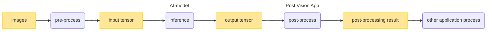
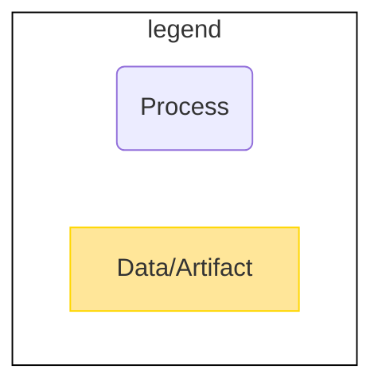

# Post Process
This tutorial shows how to create a Post Vision App for the IMX500. The Post Vision App has an AI-Post process that processes AI output into usable data for application development. This section shows how to design, implement, and build the Post Vision App.



<br>
  


## Getting Started
This tutorial includes the [sample Post Vision App](./sample/).
There are two types of sample:
- Image classification sample
  - Post-processing of the AI model output to limit the output by setting the maximum number of predictions
- Object detection sample
  - Post-processing of the AI model output to limit the output by setting the maximum number of detections and the threshold

Start with the sample to learn how to create a Post Vision App.

### Design and implement the Post Vision App
#### 1. Write a FlatBuffers schema
The output of the Post Vision App is serialized by [FlatBuffers](https://google.github.io/flatbuffers/index.html).
Define the Post Vision App output in the FlatBuffers schema file.

See the following information on writing a FlatBuffers schema.
- [Writing a schema](https://google.github.io/flatbuffers/flatbuffers_guide_writing_schema.html) in FlatBuffers documents
- Sample FlatBuffers schema files 
  - [Classification](./sample/schema/classification.fbs)
  - [Object Detection](./sample/schema/objectdetection.fbs)

#### 2. Generate a C++ header file from the FlatBuffers schema file
Open the Terminal and run the following command:
```bash
$ ./tutorials/5_post_process/compile_fbs.sh
```
Then, C++ header files are generated in **`./tutorials/5_post_process/sample/schema/`**.

> **NOTE**
> 
> The script that generates the C++ header is for the sample.
> Modify the **`docker run`** command in [compile_fbs.sh](./compile_fbs.sh) to match the location of the FlatBuffers schema file you created. For the following **`<your-schema-folder-path>`**, set the path relative to the folder containing your FlatBuffers schema file from the **`/tutorials/5_post_process`** folder.
> ```sh
> docker run --rm \
>     -v $PWD/<your-schema-folder-path>:/root/schema/ \
>     $NAME_IMAGE:latest \
>     /bin/sh -c "cd /root/schema && flatc --cpp *.fbs"
> ```

> **NOTE**
> 
> See [Using the schema compiler](https://google.github.io/flatbuffers/flatbuffers_guide_using_schema_compiler.html) for options for the **`flatc`** command in [compile_fbs.sh](./compile_fbs.sh).

#### 3. Implement a Post Vision App
Implement a Post Vision App in C or C++ languages.

Use the C++ header file generated in [Generate a C++ header file from the FlatBuffers schema file](#2-generate-a-c-header-file-from-the-flatbuffers-schema-file). The implementations using FlatBuffers need to be written in C++.

Post Vision Apps require the implementation of the Post Vision App interface. See [PPL Library API Specification for IMX500](https://developer.aitrios.sony-semicon.com/development-guides/documents/specifications/) for information. See also the [interface definition file](./ppl_sdk/imx_app/include/ppl_public.h).

See the [/tutorials/5_post_process/sample](./sample/) for the sample implementation.

> **NOTE**
> 
> The Post Vision App is compiled to Wasm file. Features that are in [libc-wasi](https://github.com/WebAssembly/wasi-libc) can be used without any extra steps, but features that are not in libc-wasi require the libraries to be statically linked.

### Build the Post Vision App
#### 1. Edit the Makefile ([Image classification](./sample/classification/Makefile) / [Object detection](./sample/objectdetection/Makefile))
If you use the sample Post Vision App, you do not need to edit the Makefile.

- If you want to statically link dependencies, add **`-I <directory>`** to the build options: **`USER_CFLAGS`**
```makefile
USER_CFLAGS    = -O2
```

- Set the names of the object files in **`CPPOBJS`**
```makefile
CPPOBJS        = ppl_classification.o \
                 $(LIBPATH)/lib/parson/parson.o
```

- Specify the .c or .cpp files to build
```makefile
%.o: %.c
```
```makefile
%.o: %.cpp
```

> **NOTE**
> 
> Other options required to build to Wasm can be added in the following.
> ```makefile
> USER_LDFLAGS   = -z stack-size=8192 \
>                  -Wl,--initial-memory=65536
> ```
> Some of changeable options are followings. If you want to tune memory of your Wasm app, please visit [Memory model and memory usage tunning](https://github.com/bytecodealliance/wasm-micro-runtime/blob/main/doc/memory_tune.md). Please understand that there are limitation to the amount of memory that can be used in total.
> | option | description | default | limitation |
> ----|----|----|----
> | -z stack-size=***NUM*** | specify stack size of thread **(aux stack area)** | 8192 > [byte]  | 16 [byte] alignment |
> | -Wl, --initial-memory=***NUM*** | specify initial usage of memory size **(libc heap)** | 65536 [byte] | 65536 [byte] alignment |
> | -I ***PATH*** | add include PATH | - | add only |

#### 2. Build
Open the Terminal and run the following command:
```bash
$ ./tutorials/5_post_process/build.sh
```
Then, the following files are generated:
- **`/tutorials/5_post_process/sample/classification/ppl_classification.wasm`**
- **`/tutorials/5_post_process/sample/objectdetection/ppl_objectdetection.wasm`**

> **TIP**
> 
> Execute the command with the **`ic`** option if you want to build only the image classification sample, and the **`od`** option if you want to build only the object detection sample.
> ```bash
> $ ./tutorials/5_post_process/build.sh <Option>
> ```
 
> **NOTE**
> 
> The build script is for building the sample. Modify the **`docker run`** command in [build.sh](./build.sh) to match the location of the Post Vision App you created. 
> For the following`<your-Makefile-folder-path>`, set the path relative to the folder containing your Makefile from the **`/tutorials/5_post_process`** folder.
> ```sh
> docker run --rm \
>     -v $PWD/<your-Makefile-folder-path>/:/root/postvisionapp/ \
>     -v $PWD/ppl_sdk/:/root/ppl_sdk/ \
>     $NAME_IMAGE:latest \
>     /bin/sh -c "cd /root/postvisionapp && make"
> ```
> As for the following [clean](#clean), the **`docker run`** command needs to be modified in the same way.

#### 3. Clean
Open the terminal and run one of the following commands depending on what you want to remove:
- Remove the generated object files and Wasm files
```bash
$ ./tutorials/5_post_process/build.sh clean
```

- Remove the generated object files, Wasm files and docker image for Wasm build
```bash
$ ./tutorials/5_post_process/build.sh cleanall
```

### (Optional) Import the Wasm file to Console for AITRIOS

If you want to import the Wasm file to Console for AITRIOS,

see [Console Manual](https://developer.aitrios.sony-semicon.com/development-guides/documents/manuals/) for details.

- Settings

>**NOTE**
>
> How to deploy post-processing application to device is described in [README for deploy](../6_deploy/README.md).
>

## References
- [FlatBuffers](https://google.github.io/flatbuffers/index.html)<br>
The version of FlatBuffers used in Vision and Sensing Application SDK is 1.11.0.

- [WASI SDK](https://github.com/WebAssembly/wasi-sdk)<br>
The version of WASI SDK used in Vision and Sensing Application SDK is wasi-sdk-16.
